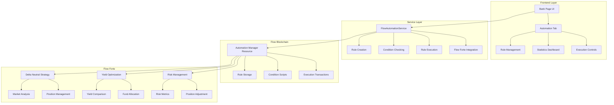
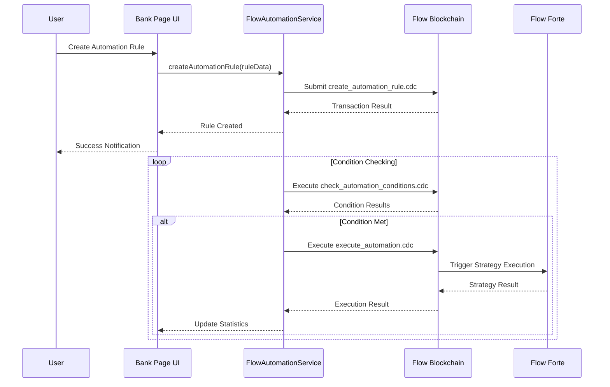
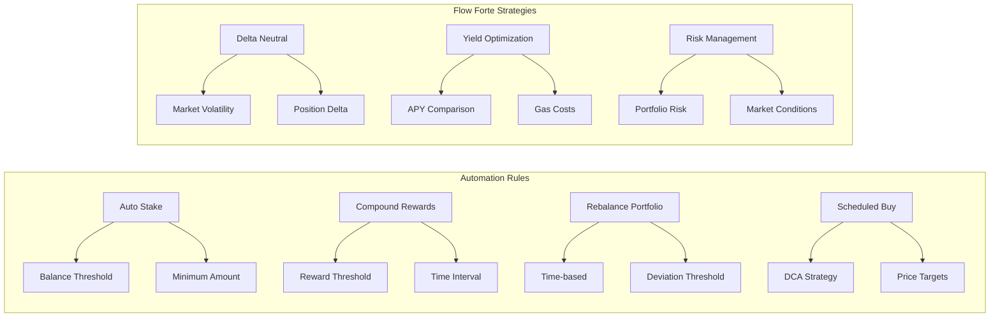
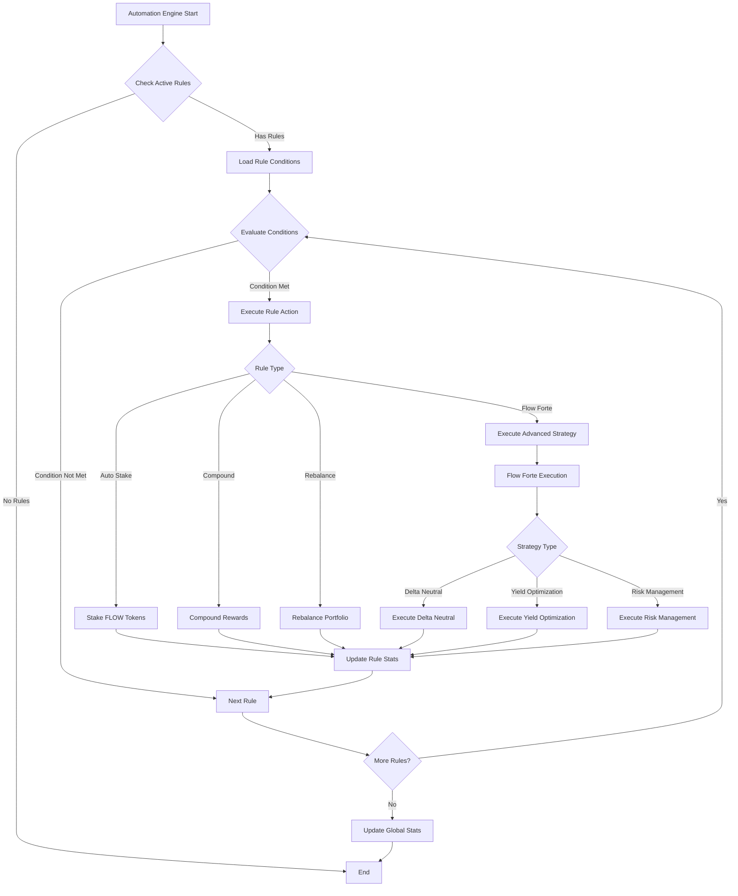
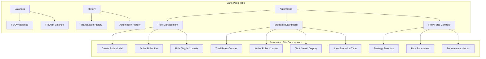
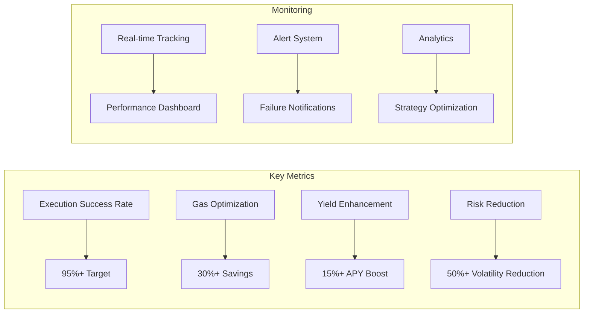
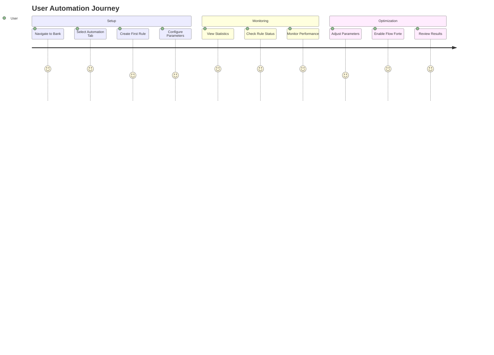

# Flow Automation & Flow Forte Architecture

Bu dokümantasyon APT Casino'da Flow Automation sisteminin ve Flow Forte entegrasyonunun nasıl çalıştığını detaylı olarak açıklar.

## 🏗️ Sistem Mimarisi



## 🔄 Automation Flow Diagram



## 📊 Rule Types & Conditions



## 🎯 Execution Engine



## 🏦 Bank Page Integration



## 🔧 Technical Implementation

### 1. Frontend Components

```javascript
// Bank Page Automation Tab
const AutomationTab = () => {
  const [automationRules, setAutomationRules] = useState([]);
  const [automationStats, setAutomationStats] = useState({
    totalRules: 0,
    activeRules: 0,
    totalSaved: 0,
    lastExecution: null
  });
  
  // Rule management functions
  const createAutomationRule = (ruleData) => { /* ... */ };
  const toggleAutomationRule = (ruleId) => { /* ... */ };
  const executeAutomationRule = (ruleId) => { /* ... */ };
};
```

### 2. Service Layer

```javascript
// FlowAutomationService
class FlowAutomationService {
  async createAutomationRule(ruleData) {
    // Submit create_automation_rule.cdc transaction
  }
  
  async checkConditions(userAddress) {
    // Execute check_automation_conditions.cdc script
  }
  
  async executeAutomationRules(userAddress, ruleIds) {
    // Execute execute_automation.cdc transaction
  }
}
```

### 3. Cadence Smart Contracts

```cadence
// AutomationManager Resource
resource AutomationManager {
  var rules: {UInt64: AutomationRule}
  
  fun createRule(...) -> UInt64
  fun executeRule(ruleId: UInt64) -> Bool
  fun checkConditions() -> {UInt64: Bool}
}
```

## 🚀 Flow Forte Advanced Features

### Delta Neutral Strategy
- **Purpose**: Market-direction independent returns
- **Method**: Balancing long and short positions
- **Trigger**: Market volatility and position delta

### Yield Optimization
- **Purpose**: Capturing highest yield opportunities
- **Method**: APY comparison across different protocols
- **Trigger**: Yield differentials and gas costs

### Risk Management
- **Purpose**: Keeping portfolio risk under control
- **Method**: Monitoring risk metrics and position adjustment
- **Trigger**: Risk thresholds and market conditions

## 📈 Performance Metrics



## 🔐 Security Features

- **Multi-signature Execution**: Multi-signature for critical operations
- **Condition Validation**: Condition verification before each rule execution
- **Gas Limit Protection**: Prevention of excessive gas usage
- **MEV Protection**: Protection from front-running attacks
- **Emergency Stop**: Stopping all automation in emergency situations

## 🎮 User Experience Flow



Through this system, users can automate their DeFi strategies to achieve optimized returns without requiring manual intervention.