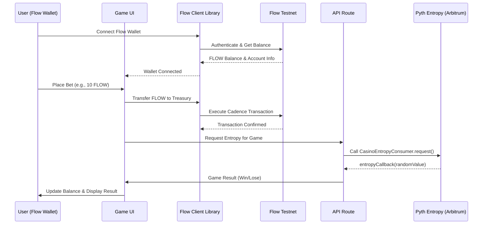

# 🎰 APT Casino - Built on Flow

A couple of days back, I was was on etherscan exploring some transactions and saw an advertisement of https://stake.com/ which was giving 200% bonus on first deposit, I deposited 120 USDT into stake.com they gave 360 USDT as total balance in their controlled custodial wallet and when I started playing casino games I was shocked to see that I was only able to play with $1 per game and was unable to increase the betting amount beyond $1 coz and when I tried to explore and play other games on the platform the issue was persisting, I reached the customer support and got to know that this platform has cheated him under the name of wager limits as I was using the bonus scheme of 200%.

When I asked the customer support to withdraw money they showed a rule list of wager limit, which said that if I wanted to withdraw the deposited amount, then I have to play $12,300 worth of gameplay and this was a big shock for me, as I was explained a maths logic by their live support. Thereby, In the hope of getting the deposited money back, I played the different games of stake.com like roulette, mines, spin wheel, etc, the entire night and lost all the money.

I was very annoyed of that's how APT-Casino was born, which is a combination of GameFi and AI all in one platform where new web3 users can play games, perform gambling, but have a safe, secure, transparent platform that does not scam any of their users. Also, I wanted to address common issues in traditional gambling platforms.

## 🧩 Problems

The traditional online gambling industry is plagued by several issues, including:

- **Unfair Game Outcomes:** 99% of platforms manipulate game results, leading to unfair play.  
- **High Fees:** Users face exorbitant fees for deposits, withdrawals, and gameplay.  
- **Restrictive Withdrawal Policies:** Withdrawal limits and conditions often prevent users from accessing their funds.  
- **Bonus Drawbacks:** Misleading bonus schemes trap users with unrealistic wagering requirements.  
- **Lack of True Asset Ownership:** Centralised platforms retain control over user assets, limiting their freedom and security.  
- **User Adoption of Web2 Users:** Bringing users to web3 and complexity of using wallet first time is kinda difficult for web2 users.  
- **No Social Layer:** No live streaming, no community chat, no collaborative experience.

## 💡 Solution

**APT-Casino** addresses these problems by offering:

- **Provably Fair Gaming:** Utilising the **Flow VRF** on-chain randomness module, my platform ensures all game outcomes are 100% transparent and verifiably fair.


- **Flexible Withdrawal Policies:** Providing users with unrestricted access to their funds.  
- **Transparent Bonus Schemes:** Clear and clean bonus terms without hidden traps.  
- **True Asset Ownership:** Decentralised asset management ensures users have full control over their assets.  
- **Fully Gasless and Zero Requirement of Confirming Transactions:** Users do not require to pay gas fees. It's paid by our treasury address to approve a single transaction — we do it all, they can just play as if they are playing in their web2 platforms.  
- **Live Streaming Integration:** Built with **Livepeer**, enabling real-time game streams, tournaments, and live dealer interaction.  
- **On-Chain Chat:** **Supabase + Socket.IO** + wallet-signed messages ensure verifiable, real-time communication between players.  
- **ROI Share Links:** Every withdrawal (profit or loss) generates a shareable proof-link that renders a dynamic card (similar to Binance Futures PnL cards) when posted on X.

## ⚙️ Key Features

- **On-Chain Randomness:** Utilizing **Flow VRF** on-chain randomness module to ensure provably fair game outcomes.


- **Decentralized Asset Management:** Users retain full control over their funds through secure and transparent blockchain transactions.  
- **User-Friendly Interface:** An intuitive and secure interface for managing funds, placing bets, and interacting with games.  
- **Diverse Game Selection:** A variety of fully on-chain games, including roulette, mines, plinko, and spin wheel. As a (POC) Proof of Concept, developed fully on-chain 4 games but similar model can be applied to introduce the new casino games to the platform.  
- **Fully Gasless and Zero Requirement of Confirming Transactions:** Users do not require to pay gas fees. It's paid by our treasury address to approve a single transaction — we do it all, they can just play as if they are playing in their web2 platforms.  
- **Real-Time Updates:** Live game state and balance updates.  
- **Event System:** Comprehensive event tracking for all game actions.  
- **Social Layer:** Live streaming, on-chain chat, and NFT-based player profiles.

## 🧩 Architecture


- **Frontend**: Next.js (App Router), React 18, Tailwind, MUI, Three.js
- **Wallet/Chain**: wagmi + RainbowKit
- **Randomness**: Flow VRF
- **State**: Redux Toolkit + React Query
- **Social**: Livepeer for streaming, Supabase + Socket.io for real-time chat

**APT Casino** is a fully decentralized casino platform that leverages Flow blockchain's unique architecture to deliver a transparent, secure, and user-friendly gambling experience. Built with Flow's native features including Flow Client Library (FCL), smart contracts, and Flow Testnet infrastructure, APT Casino addresses critical issues in traditional online gambling platforms through blockchain transparency and provably fair game mechanics.

## 🔗 Built on Flow Testnet

This project is **deployed and operational on Flow Testnet**. All smart contract interactions, wallet connections, and transactions use Flow's network infrastructure.

## 📋 Deployed Contract Addresses

### Flow Testnet Contracts

#### Flow Native Contracts
- **FLOW TREASURY ADDRESS**: https://testnet.flowscan.io/account/0x2083a55fb16f8f60

#### Casino Contracts (Flow Testnet)
- **Casino Contract**: https://testnet.flowscan.io/contract/A.2083a55fb16f8f60.CasinoGames?tab=deployments
- **Flow Treasury Address**: `0x2083a55fb16f8f60` (or as configured in environment)

### 🔐 Core Flow Features Used

#### **Flow Client Library (FCL) Integration**
- Seamless wallet connection using Flow's native wallet discovery
- Gasless transactions via treasury-sponsored flows
- Cadence 1.0 scripts for on-chain data queries
- Flow wallet compatibility (Blocto, Dapper, Ledger Flow, etc.)
- **Resource-Oriented Security**: Flow's resource model ensures secure token transfers
- **On-Chain Balance Queries**: Real-time FLOW token balance verification via Cadence scripts

### 🎲 Key Features

#### Provably Fair Gaming
- **FLOW VRF Integration**: On-chain cryptographic randomness via FLOW VRF
- **Transparent Outcomes**: All randomness verifiable on-chain with cryptographic proofs
- **Audit Trail**: Every game result permanently stored on-chain

#### Gasless User Experience
- **Treasury-Sponsored Transactions**: Users never pay gas fees
- **Single Transaction Approval**: Simplified UX - users just approve once and play
- **Web2-Like Experience**: Feels like traditional platforms but with blockchain security

#### True Asset Ownership
- **User Wallet Control**: Funds remain in user's Flow wallet until game execution
- **No Custodial Risk**: Platform cannot freeze or seize user funds
- **Instant Withdrawals**: No withdrawal limits or approval delays
- **Transparent Balance**: Real-time Flow blockchain balance display

#### Diverse Game Selection
- **Roulette**: European layout with batch betting
- **Mines**: Pattern-based game with variable risk levels
- **Plinko**: Physics-based ball drop mechanics
- **Wheel**: Multiple segments with adjustable volatility

#### Social Layer
- **Live Streaming**: Livepeer integration for real-time game streams and tournaments
- **On-Chain Chat**: Supabase + Socket.IO with wallet-signed messages for verifiable communication
- **ROI Share Links**: Shareable proof-links that render dynamic PnL cards on social platforms

## 🏗️ Architecture

### Flow-Centric Architecture

```
┌─────────────────────────────────────────────────────────────┐
│                    Frontend (Next.js)                       │
│  ┌──────────────┐  ┌──────────────┐  ┌──────────────┐      │
│  │ Flow Wallet  │  │  Game UI    │  │  Live Chat  │      │
│  │   (FCL)      │  │ (Three.js)  │  │  (Supabase) │      │
│  └──────────────┘  └──────────────┘  └──────────────┘      │
└─────────────────────────────────────────────────────────────┘
                            │
                            ▼
┌─────────────────────────────────────────────────────────────┐
│              Flow Blockchain Integration                      │
│  ┌────────────────────────────────────────────────────┐    │
│  │  Flow Client Library (FCL)                         │    │
│  │  - Wallet Discovery & Connection                   │    │
│  │  - Script Execution                                │    │
│  │  - Transaction Signing & Submission                │    │
│  └────────────────────────────────────────────────────┘    │
│                                                              │
│  ┌────────────────────────────────────────────────────┐    │
│  │  Flow Testnet                                      │    │
│  │  - FLOW Token Contracts                            │    │
│  │  - Treasury Wallet (0x2083a55fb16f8f60)           │    │
│  │  - Scripts (Balance Queries)                      │    │
│  └────────────────────────────────────────────────────┘    │
└─────────────────────────────────────────────────────────────┘
                            │
                            ▼
┌─────────────────────────────────────────────────────────────┐
│             FLOW VRF                                        │
│  ┌────────────────────────────────────────────────────┐    │
│  │  CasinoEntropyConsumer Contract                   │    │
│  │  Address                                          │ │
│  │  - Request Entropy                                │    │
│  │  - Receive Callback with Random Value             │    │
│  │  - Emit Events for Game Results                   │    │
│  └────────────────────────────────────────────────────┘    │
└─────────────────────────────────────────────────────────────┘
```

## 🎮 Game Execution Flow (Flow Integration)



## 🚀 Getting Started

### Prerequisites
- Node.js >= 18.0.0
- npm or yarn
- Metamask/ Flow wallet (Blocto, Dapper, or other FCL-compatible wallet)

### Installation

```bash
# Clone the repository
git clone https://github.com/your-username/APT-Casino-Flow.git
cd APT-Casino-Flow

# Install dependencies
npm install

# Set up environment variables
cp .env.example .env.local
```

### Environment Variables

Create a `.env.local` file with the following:

```bash
# Flow Configuration
NEXT_PUBLIC_FLOW_NETWORK="testnet"
NEXT_PUBLIC_FLOW_TREASURY_ADDRESS="0x2083a55fb16f8f60"
FLOW_TREASURY_PRIVATE_KEY="your_treasury_private_key"

# Social Features
NEXT_PUBLIC_LIVEPEER_API_KEY="your_livepeer_key"
DATABASE_URL="your_postgres_url"
REDIS_URL="your_redis_url"
```

### Development

```bash
# Start development server
npm run dev

# Build for production
npm run build

# Start production server
npm start
```

The application will be available at `http://localhost:3000`

## 🔧 Flow Integration Details

### Flow Wallet Connection

The project uses Flow Client Library (FCL) for seamless wallet integration:

```javascript
import * as fcl from "@onflow/fcl";

// Configure FCL for Flow Testnet
fcl.config({
  "accessNode.api": "https://rest-testnet.onflow.org",
  "discovery.wallet": "https://fcl-discovery.onflow.org/testnet/authn"
});

// Connect wallet
const user = await fcl.authenticate();
```

## 🎯 Hackathon Track Alignment

This project aligns with the following Forte Hacks tracks:

- **Best Killer App on Flow**: Consumer-focused casino platform for mass adoption
- **Best Use of Flow Core Features**: Extensive use of FCL, Cadence 1.0, Flow wallet ecosystem
- **Best Existing Code Integration**: Integration of existing Pyth Entropy with Flow blockchain

## 📹 Demo & Links

- **Live Demo**: https://apt-casino-flow.vercel.app/
- **Pitch Deck**: https://www.figma.com/deck/w6uEPX0mlzm3X0EHdZ3HsB/APT-Casino-Flow?node-id=1-1812&p=f&t=Mobb2fLKVbG84e5v-1&scaling=min-zoom&content-scaling=fixed&page-id=0%3A1

## 🛠️ Commands

```bash
# Development
npm run dev              # Start dev server
npm run build            # Production build
npm start                # Start production server
npm run lint             # Run linter

# Flow-specific
npm run deploy:flow      # Deploy Flow contracts (if configured)
npm run fund-treasury    # Fund Flow treasury
```

## 📝 Submission Checklist

- ✅ **Deployed on Flow Testnet**: All Flow operations use Flow Testnet
- ✅ **README.md**: This file states project is built on Flow
- ✅ **Contract Addresses**: Listed above (Flow Testnet)
- ✅ **GitHub Repository**: Public and accessible

## 🗺️ Roadmap

### Phase 1 (Current)
- ✅ Flow wallet integration with FCL
- ✅ Flow treasury system
- ✅ 4 core games (Roulette, Mines, Plinko, Wheel)

### Phase 2
- [ ] Deploy smart contracts on Flow Mainnet
- [ ] Flow Actions integration for automated workflows
- [ ] Flow scheduled transactions for recurring events
- [ ] Expand game catalog
- [ ] Flow-native NFT integration for player profiles

### Phase 3
- [ ] In-app tournaments with Flow-based leaderboards
- [ ] SDK for third-party game developers
- [ ] Developer platform for gambling game launchpad
- [ ] Cross-chain bridges for multi-chain support
