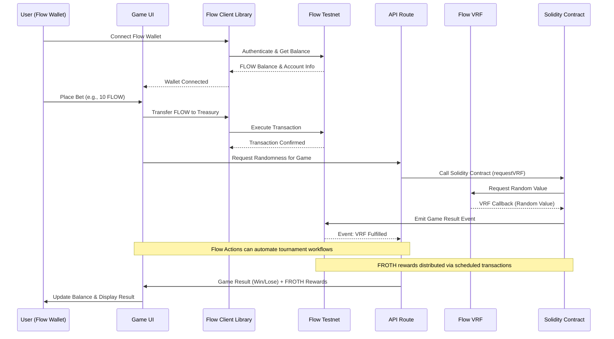
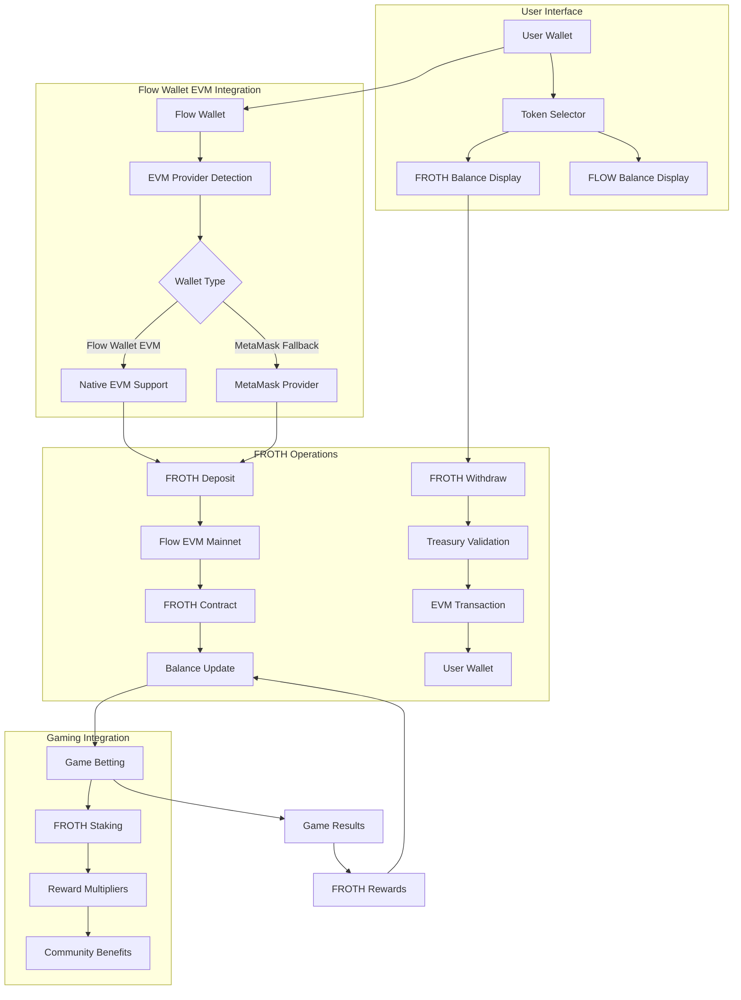
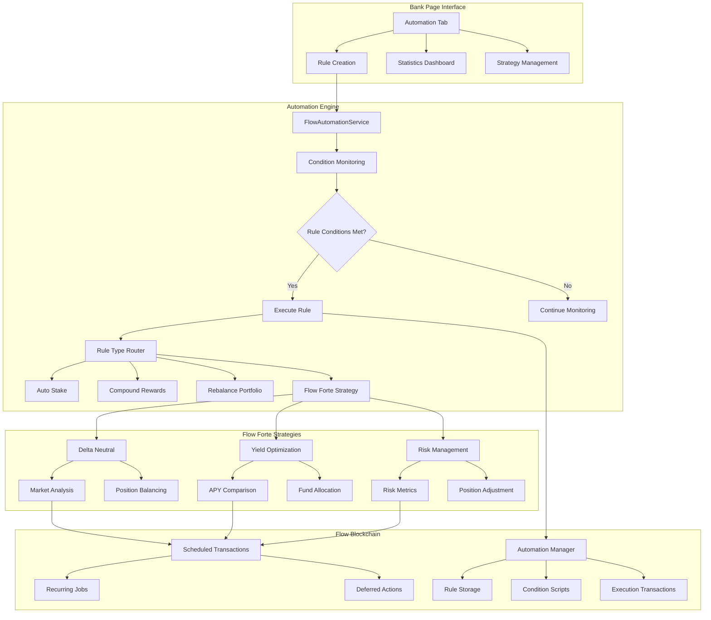
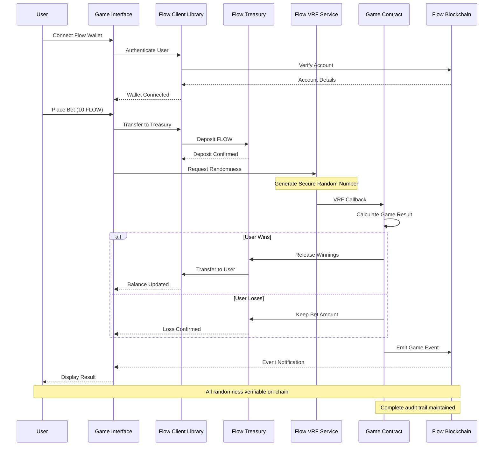
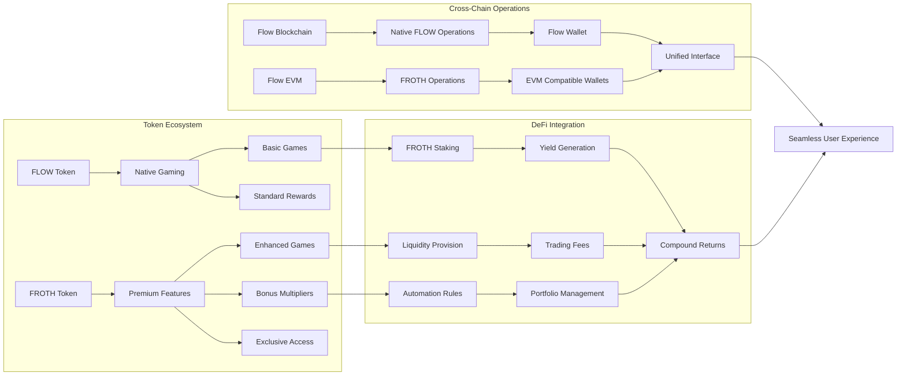
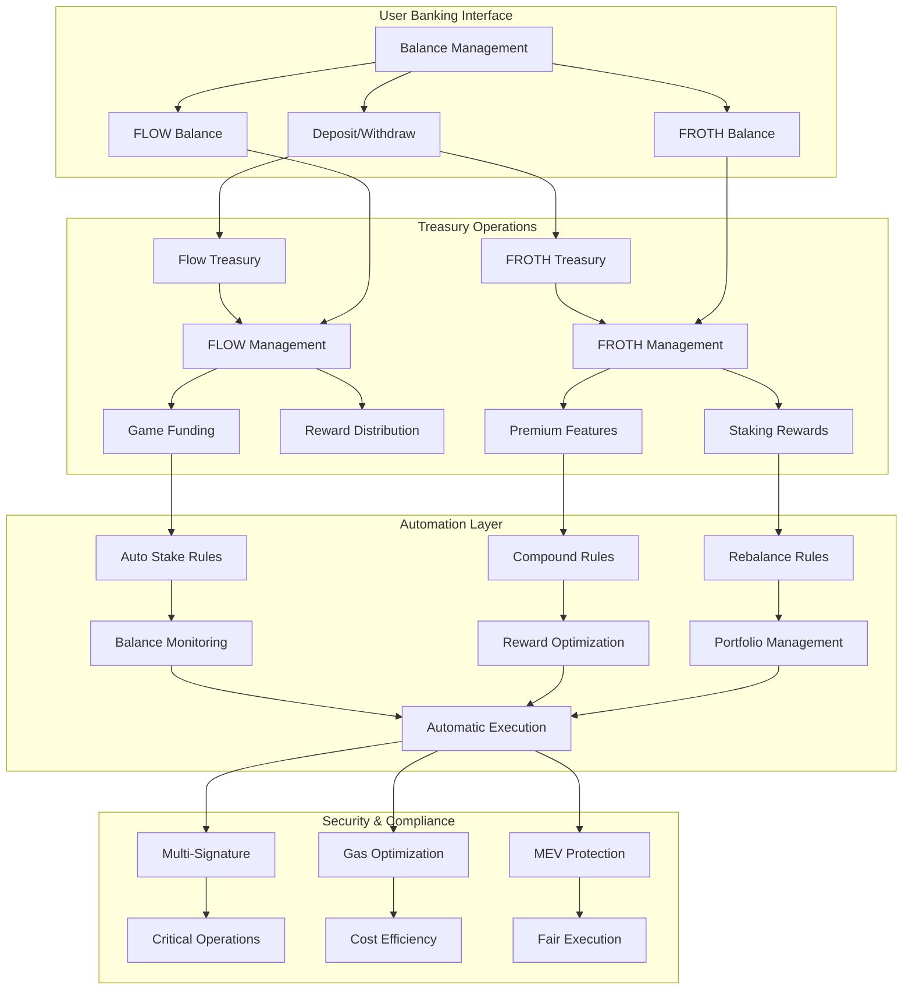

# 🎰 APT Casino - Built on Flow

A couple of days back, I was was on etherscan exploring some transactions and saw an advertisement of https://stake.com/ which was giving 200% bonus on first deposit, I deposited 120 USDT into stake.com they gave 360 USDT as total balance in their controlled custodial wallet and when I started playing casino games I was shocked to see that I was only able to play with $1 per game and was unable to increase the betting amount beyond $1 coz and when I tried to explore and play other games on the platform the issue was persisting, I reached the customer support and got to know that this platform has cheated him under the name of wager limits as I was using the bonus scheme of 200%.

When I asked the customer support to withdraw money they showed a rule list of wager limit, which said that if I wanted to withdraw the deposited amount, then I have to play $12,300 worth of gameplay and this was a big shock for me, as I was explained a maths logic by their live support. Thereby, In the hope of getting the deposited money back, I played the different games of stake.com like roulette, mines, spin wheel, etc, the entire night and lost all the money.

I was very annoyed of that's how APT-Casino was born, which is a combination of GameFi and AI all in one platform where new web3 users can play games, perform gambling, but have a safe, secure, transparent platform that does not scam any of their users. Also, I wanted to address common issues in traditional gambling platforms.

## 🧩 Problems

The traditional online gambling industry is plagued by several issues, including:

- **Unfair Game Outcomes:** 99% of platforms manipulate game results, leading to unfair play.  
- **High Fees:** Users face exorbitant fees for deposits, withdrawals, and gameplay.  
- **Restrictive Withdrawal Policies:** Withdrawal limits and conditions often prevent users from accessing their funds.  
- **Bonus Drawbacks:** Misleading bonus schemes trap users with unrealistic wagering requirements.  
- **Lack of True Asset Ownership:** Centralised platforms retain control over user assets, limiting their freedom and security.  
- **User Adoption of Web2 Users:** Bringing users to web3 and complexity of using wallet first time is kinda difficult for web2 users.  
- **No Social Layer:** No live streaming, no community chat, no collaborative experience.

## 💡 Solution

**APT-Casino** addresses these problems by offering:

- **Provably Fair Gaming:** Utilising the **Flow VRF** on-chain randomness module with **Flow Forte Actions** for automated workflows, ensuring all game outcomes are 100% transparent and verifiably fair.


- **FROTH Token Integration:** Leveraging KittyPunch's $FROTH token ecosystem for gaming experiences, rewards, and community engagement.
- **Flexible Withdrawal Policies:** Providing users with unrestricted access to their funds.
- **Transparent Bonus Schemes:** Clear and clean bonus terms without hidden traps.
- **True Asset Ownership:** Decentralised asset management ensures users have full control over their assets.
- **Fully Gasless and Zero Requirement of Confirming Transactions:** Users do not require to pay gas fees. It's paid by our treasury address to approve a single transaction — we do it all, they can just play as if they are playing in their web2 platforms.
- **Live Streaming Integration:** Built with **Livepeer**, enabling real-time game streams, tournaments, and live dealer interaction.
- **On-Chain Chat:** **Supabase + Socket.IO** + wallet-signed messages ensure verifiable, real-time communication between players.
- **ROI Share Links:** Every withdrawal (profit or loss) generates a shareable proof-link that renders a dynamic card (similar to Binance Futures PnL cards) when posted on X.

## ⚙️ Key Features

- **On-Chain Randomness:** Utilizing **Flow VRF** on-chain randomness module to ensure provably fair game outcomes.


- **Flow Forte Actions Integration:** Leveraging Flow Actions (FLIP-338) for automated, reusable onchain workflows that enable protocol composition and AI agent integration.
- **FROTH Token Ecosystem:** Built on KittyPunch's $FROTH token for gaming experiences, community rewards, and in-game economies.
- **Scheduled Transactions:** Utilizing Flow's scheduled transactions feature for autonomous workflows, recurring jobs, and deferred actions without external keepers.
- **Decentralized Asset Management:** Users retain full control over their funds through secure and transparent blockchain transactions.
- **User-Friendly Interface:** An intuitive and secure interface for managing funds, placing bets, and interacting with games.
- **Diverse Game Selection:** A variety of fully on-chain games, including roulette, mines, plinko, and spin wheel. As a (POC) Proof of Concept, developed fully on-chain 4 games but similar model can be applied to introduce the new casino games to the platform.
- **Fully Gasless and Zero Requirement of Confirming Transactions:** Users do not require to pay gas fees. It's paid by our treasury address to approve a single transaction — we do it all, they can just play as if they are playing in their web2 platforms.
- **Real-Time Updates:** Live game state and balance updates.
- **Event System:** Comprehensive event tracking for all game actions.
- **Social Layer:** Live streaming, on-chain chat, and NFT-based player profiles.

## 🧩 Architecture


- **Frontend**: Next.js (App Router), React 18, Tailwind, MUI, Three.js
- **Wallet/Chain**: Flow Client Library (FCL) + wagmi + RainbowKit
- **Smart Contracts**: Solidity
- **Randomness**: Flow VRF
- **Automation**: Flow Forte Actions (FLIP-338) + Scheduled Transactions
- **Token Economy**: $FROTH token integration (KittyPunch ecosystem)
- **State**: Redux Toolkit + React Query
- **Social**: Livepeer for streaming, Supabase + Socket.io for real-time chat

**APT Casino** is a fully decentralized casino platform that leverages Flow blockchain's unique architecture to deliver a transparent, secure, and user-friendly gambling experience. Built with Flow's native features including Flow Client Library (FCL), Solidity smart contracts, and Flow Testnet infrastructure, APT Casino addresses critical issues in traditional online gambling platforms through blockchain transparency and provably fair game mechanics.

## 🔗 Built on Flow Testnet

This project is **deployed and operational on Flow Testnet**. All smart contract interactions, wallet connections, and transactions use Flow's network infrastructure.

## 📋 Deployed Contract Addresses

### Flow Testnet Contracts

#### Flow Native Contracts
- **FLOW TREASURY ADDRESS**: https://testnet.flowscan.io/account/0x2083a55fb16f8f60

#### Casino Contracts (Flow Testnet)
- **Casino Contract**: https://testnet.flowscan.io/contract/A.2083a55fb16f8f60.CasinoGames?tab=deployments
- **Flow Treasury Address**: `0x2083a55fb16f8f60` (or as configured in environment)

### 🔐 Core Flow Features Used

#### **Flow Client Library (FCL) Integration**
- Direct wallet connection using Flow's native wallet discovery
- Gasless transactions via treasury-sponsored flows
- Flow wallet compatibility (Blocto, Dapper, Ledger Flow, etc.)
- **Solidity Smart Contracts**: All game logic implemented in Solidity
- **On-Chain Balance Queries**: Real-time FLOW token balance verification via FCL queries

#### **Flow Forte Actions (FLIP-338)**
- Automated tournament workflows and recurring game events
- AI agent integration for intelligent game management
- Protocol composition without external dependencies
- Trustless workflow execution with built-in safety checks

#### **FROTH Token Ecosystem Integration**
- $FROTH as premium in-game currency and reward mechanism
- Staking incentives for gaming experiences
- Community rewards and exclusive access features
- NFT drops and collectible experiences powered by $FROTH

### 🎲 Key Features

#### Provably Fair Gaming
- **FLOW VRF Integration**: On-chain cryptographic randomness via FLOW VRF
- **Transparent Outcomes**: All randomness verifiable on-chain with cryptographic proofs
- **Audit Trail**: Every game result permanently stored on-chain

#### Gasless User Experience
- **Treasury-Sponsored Transactions**: Users never pay gas fees
- **Single Transaction Approval**: Simplified UX - users just approve once and play
- **Web2-Like Experience**: Feels like traditional platforms but with blockchain security

#### True Asset Ownership
- **User Wallet Control**: Funds remain in user's Flow wallet until game execution
- **No Custodial Risk**: Platform cannot freeze or seize user funds
- **Instant Withdrawals**: No withdrawal limits or approval delays
- **Transparent Balance**: Real-time Flow blockchain balance display

#### Diverse Game Selection
- **Roulette**: European layout with batch betting
- **Mines**: Pattern-based game with variable risk levels
- **Plinko**: Physics-based ball drop mechanics
- **Wheel**: Multiple segments with adjustable volatility

#### Social Layer
- **Live Streaming**: Livepeer integration for real-time game streams and tournaments
- **On-Chain Chat**: Supabase + Socket.IO with wallet-signed messages for verifiable communication
- **ROI Share Links**: Shareable proof-links that render dynamic PnL cards on social platforms

## 🏗️ Architecture

### Flow-Centric Architecture

```
┌─────────────────────────────────────────────────────────────┐
│                    Frontend (Next.js)                       │
│  ┌──────────────┐  ┌──────────────┐  ┌──────────────┐      │
│  │ Flow Wallet  │  │  Game UI    │  │  Live Chat  │      │
│  │   (FCL)      │  │ (Three.js)  │  │  (Supabase) │      │
│  └──────────────┘  └──────────────┘  └──────────────┘      │
└─────────────────────────────────────────────────────────────┘
                            │
                            ▼
┌─────────────────────────────────────────────────────────────┐
│              Flow Blockchain Integration                      │
│  ┌────────────────────────────────────────────────────┐    │
│  │  Flow Client Library (FCL)                         │    │
│  │  - Wallet Discovery & Connection                   │    │
│  │  - Transaction Signing & Submission                │    │
│  │  - Balance Queries                                 │    │
│  └────────────────────────────────────────────────────┘    │
│                                                              │
│  ┌────────────────────────────────────────────────────┐    │
│  │  Flow Testnet                                      │    │
│  │  - FLOW Token Contracts                            │    │
│  │  - Treasury Wallet (0x2083a55fb16f8f60)           │    │
│  │  - Solidity Smart Contracts                        │    │
│  └────────────────────────────────────────────────────┘    │
└─────────────────────────────────────────────────────────────┘
                            │
                            ▼
┌─────────────────────────────────────────────────────────────┐
│             FLOW VRF                                        │
│  ┌────────────────────────────────────────────────────┐    │
│  │  CasinoVRFConsumer Contract (Solidity)            │    │
│  │  - Request VRF                                     │    │
│  │  - Receive Callback with Random Value               │    │
│  │  - Emit Events for Game Results                     │    │
│  └────────────────────────────────────────────────────┘    │
└─────────────────────────────────────────────────────────────┘
                            │
                            ▼
┌─────────────────────────────────────────────────────────────┐
│             FLOW FORTE ACTIONS & FROTH                     │
│  ┌────────────────────────────────────────────────────┐    │
│  │  Flow Actions (FLIP-338)                           │    │
│  │  - Automated Workflows                              │    │
│  │  - Protocol Composition                             │    │
│  │  - AI Agent Integration                             │    │
│  └────────────────────────────────────────────────────┘    │
│                                                              │
│  ┌────────────────────────────────────────────────────┐    │
│  │  FROTH Token Ecosystem                             │    │
│  │  - In-Game Currency                                 │    │
│  │  - Community Rewards                                │    │
│  │  - Gaming Incentives                                 │    │
│  └────────────────────────────────────────────────────┘    │
└─────────────────────────────────────────────────────────────┘
```

## 🎮 Game Execution Flow (Flow Integration)



## 🚀 Getting Started

### Prerequisites
- Node.js >= 18.0.0
- npm or yarn
- Metamask/ Flow wallet (Blocto, Dapper, or other FCL-compatible wallet)

### Installation

```bash
# Clone the repository
git clone https://github.com/your-username/APT-Casino-Flow.git
cd APT-Casino-Flow

# Install dependencies
npm install

# Set up environment variables
cp .env.example .env.local
```

### Environment Variables

Create a `.env.local` file with the following:

```bash
# Flow Configuration
NEXT_PUBLIC_FLOW_NETWORK="testnet"
NEXT_PUBLIC_FLOW_TREASURY_ADDRESS="0x2083a55fb16f8f60"
FLOW_TREASURY_PRIVATE_KEY="your_treasury_private_key"

# Social Features
NEXT_PUBLIC_LIVEPEER_API_KEY="your_livepeer_key"
DATABASE_URL="your_postgres_url"
REDIS_URL="your_redis_url"
```

### Development

```bash
# Start development server
npm run dev

# Build for production
npm run build

# Start production server
npm start
```

The application will be available at `http://localhost:3000`

## 🔧 Flow Integration Details

### Flow Wallet Connection

The project uses Flow Client Library (FCL) for wallet integration:

```javascript
import * as fcl from "@onflow/fcl";

// Configure FCL for Flow Testnet
fcl.config({
  "accessNode.api": "https://rest-testnet.onflow.org",
  "discovery.wallet": "https://fcl-discovery.onflow.org/testnet/authn"
});

// Connect wallet
const user = await fcl.authenticate();
```

### Solidity Smart Contracts

All game logic and VRF integration are implemented using Solidity smart contracts:

- **CasinoEntropyConsumer.sol**: Main contract handling VRF requests and game outcomes
- **Treasury Contract**: Manages deposits and withdrawals using Solidity
- Contracts interact with Flow blockchain through FCL and Flow's transaction system

## 🎲 Flow VRF Powered Fairness

### What is Flow VRF?

Flow VRF (Verifiable Random Function) is Flow blockchain's native decentralized randomness service that provides cryptographically secure random numbers on-chain. It ensures fair and unpredictable game outcomes for casino applications running on Flow Testnet.

### Why Flow VRF Matters

- **Cryptographically Secure Randomness**: Uses Flow's native VRF implementation for provably random numbers
- **On-Chain Verification**: All randomness requests and results are verifiable directly on Flow blockchain
- **High Throughput**: Designed for gaming applications with low latency requirements
- **Immune to Manipulation**: Randomness cannot be manipulated by players, casino, or validators
- **Complete Audit Trail**: Every VRF request and result is permanently stored on-chain with full transparency

### Verify On-Chain

All VRF requests and results can be verified directly on Flow Testnet using Flowscan:
- View VRF requests as transactions
- Verify randomness proofs
- Audit complete game history

### How Flow VRF Works

**Step 1: VRF Request**  
When you start a game, a randomness request is sent to Flow VRF on Flow Testnet. The request includes game parameters and required fee.

**Step 2: Random Value Generation**  
Flow VRF generates a cryptographically secure random number using Flow's native randomness oracle.

**Step 3: Callback Execution**  
The random value is delivered via callback to your Solidity contract, triggering game logic execution.

**Step 4: Result Storage**  
Game outcome is calculated, events are emitted, and results are permanently stored on-chain.

### Example Usage

```javascript
import flowVRFService from '@/services/FlowVRFService';

const result = await flowVRFService.generateRandom('ROULETTE', {
  purpose: 'roulette_spin',
  gameType: 'ROULETTE',
  betAmount: 0.1
});
```

## ⚡ Flow Forte Actions & FROTH Integration

### What are Flow Forte Actions?

Flow Forte Actions (FLIP-338) are self-contained, reusable onchain building blocks that enable protocol composition and AI agent integration. Think of them as standardized onchain APIs that plug together like Lego bricks, allowing for automated workflows without external keepers or servers.

### Key Benefits of Flow Actions

- **Automated Workflows**: Create complex multi-protocol transactions that execute atomically
- **AI Agent Integration**: Enable AI agents to discover and compose onchain protocols safely
- **No External Dependencies**: Fully onchain execution without off-chain keepers
- **Trustless Composition**: Built-in safety checks and verifiable success criteria
- **Protocol Discovery**: Instant discovery of available protocols and actions

### Scheduled Transactions

Flow's scheduled transactions allow smart contracts to execute code at (or after) a chosen time without external transactions. This enables:

- **Recurring Jobs**: Automated periodic tasks and maintenance
- **Deferred Actions**: Schedule work for future execution
- **Autonomous Workflows**: Self-executing processes without manual intervention

### FROTH Token Ecosystem

APT Casino integrates with KittyPunch's $FROTH token ecosystem to create gaming experiences:

### FROTH Integration Features

- **In-Game Currency**: $FROTH serves as premium in-game currency for additional features
- **Reward Mechanism**: Earn $FROTH through gameplay achievements and tournaments
- **Staking Incentives**: Stake $FROTH for boosted rewards and exclusive access
- **Community Engagement**: Social features and competitions using $FROTH
- **NFT Integration**: $FROTH-powered NFT drops and collectible experiences

### How FROTH Enhances Gaming

**Gaming Applications**: $FROTH serves as an in-game currency, reward mechanism, and staking asset for casino experiences.

**Social/Community Tools**: Create platforms for $FROTH holders to interact, compete, and collaborate in exclusive casino communities.

### Example Flow Forte Actions Usage

```javascript
// Automated tournament workflow using Flow Actions
const tournamentAction = await flowActions.compose({
  name: 'AutomatedTournament',
  steps: [
    {
      action: 'registerPlayers',
      contract: 'TournamentManager',
      params: { tournamentId, maxPlayers: 100 }
    },
    {
      action: 'scheduleStart',
      contract: 'ScheduledTransactions',
      params: { executeAt: tournamentStartTime }
    },
    {
      action: 'distributeRewards',
      contract: 'FrothRewards',
      params: { winners, frothAmounts }
    }
  ]
});
```

### FROTH Token Integration Example

```javascript
// FROTH staking for bonus multipliers
const frothStaking = await frothService.stake({
  amount: '100',
  duration: '30days',
  benefits: ['bonusMultiplier', 'exclusiveAccess', 'earlyEntry']
});

// Community rewards distribution
const rewards = await frothService.distributeRewards({
  winners: ['0x123...', '0x456...'],
  amounts: ['50', '30'],
  reason: 'weekly_tournament'
});
```

## 🛠️ Commands

```bash
# Development
npm run dev              # Start dev server
npm run build            # Production build
npm start                # Start production server
npm run lint             # Run linter

# Contract Deployment
npm run deploy:flow      # Deploy Solidity contracts to Flow (if configured)
npm run fund-treasury    # Fund Flow treasury
```

## Business Model


## Roadmap


## 🗺️ Roadmap

### Phase 1 (Current)
- ✅ Flow wallet integration with FCL
- ✅ Flow treasury system
- ✅ Flow VRF integration for provably fair gaming
- ✅ Flow Forte Actions (FLIP-338) for automated workflows
- ✅ FROTH token ecosystem integration (KittyPunch)
- ✅ Scheduled transactions for autonomous processes
- ✅ 4 core games (Roulette, Mines, Plinko, Wheel)

### Phase 2
- [ ] Deploy Solidity smart contracts on Flow Mainnet
- [ ] Flow Actions composition for complex multi-protocol workflows
- [ ] AI agent integration with automated tournament management
- [ ] Improved FROTH staking and reward mechanisms
- [ ] Expand game catalog with FROTH-powered features
- [ ] Flow-native NFT integration for player profiles

### Phase 3
- [ ] In-app tournaments with Flow-based leaderboards and FROTH prizes
- [ ] SDK for third-party game developers with Flow Actions support
- [ ] Developer platform for gambling game launchpad
- [ ] Cross-chain bridges for multi-chain FROTH support

## 📹 Demo & Links

- **Live URL**: https://apt-casino-flow.vercel.app
- **Pitch Deck**: https://www.figma.com/deck/w6uEPX0mlzm3X0EHdZ3HsB/APT-Casino-Flow?node-id=1-1812&p=f&t=Mobb2fLKVbG84e5v-1&scaling=min-zoom&content-scaling=fixed&page-id=0%3A1

## 🔧 Technical Architecture Diagrams

### 🪙 FROTH Token Integration Flow



### 🤖 Flow Automation & Flow Forte Architecture



### 🎲 Flow VRF Integration & Game Flow



### 🔄 Multi-Token Gaming Ecosystem



### 🏦 Banking & Treasury Management


